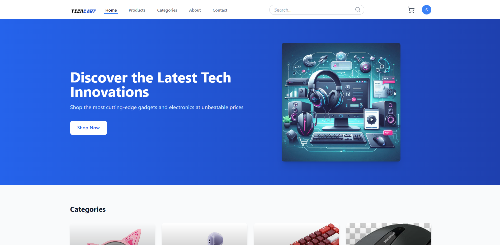
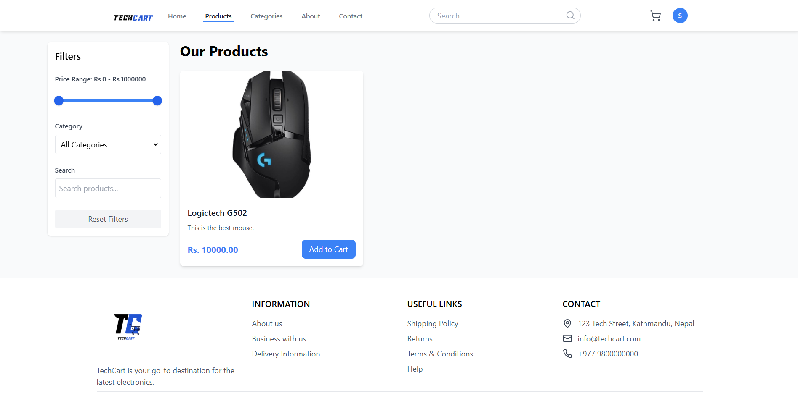
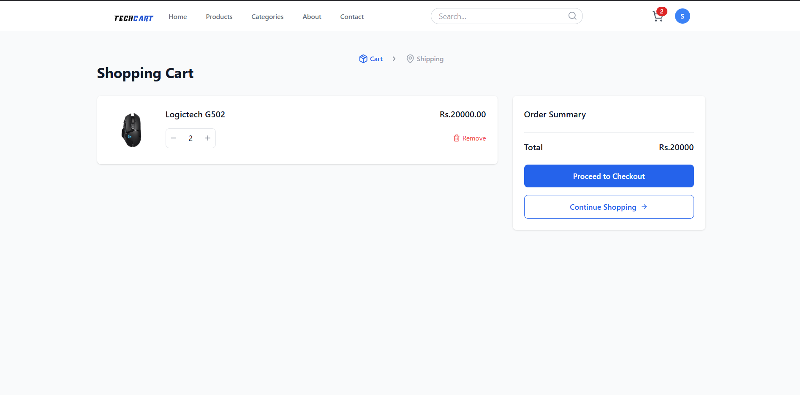
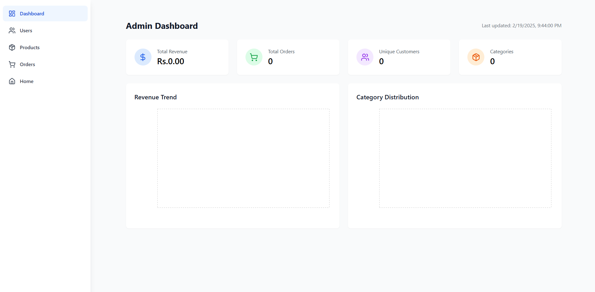
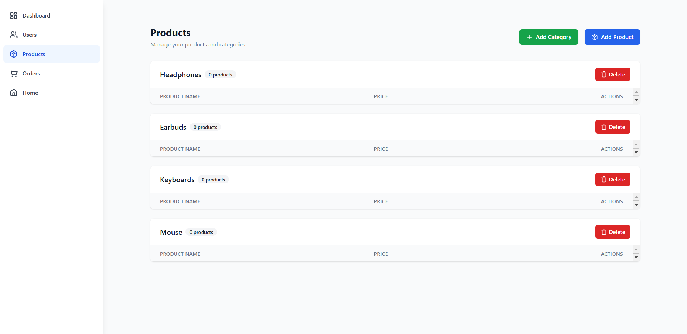
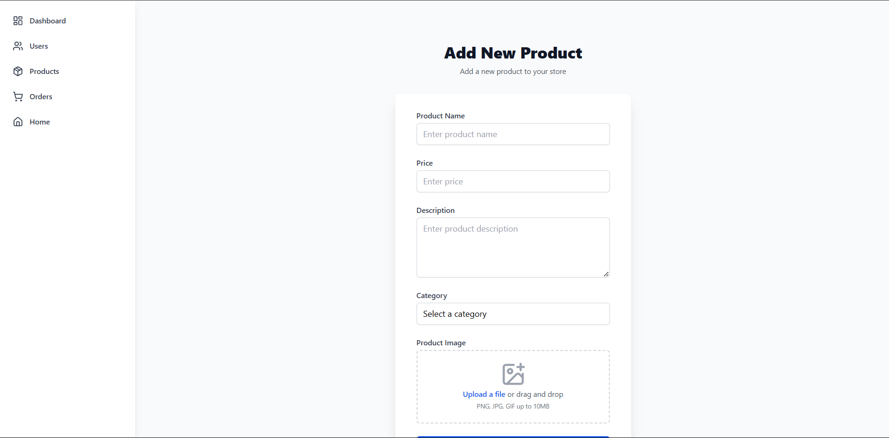

# Project Title

TechCart Project

## Description

This project is an E-commerce platform designed to provide users with a convenient and seamless shopping experience. It aims to offer computer-related items with ease.

## Technologies Used

### Frontend:

- HTML, CSS, JavaScript
- React.js (frontend library)
- Tailwind CSS

### Backend:

- Node.js
- Express.js
- MySQL (database)

### Authentication:

- JSON Web Tokens (JWT)

### Other tools:

- Git (for version control)

## Setup Instructions

### Installation

1. Clone the repository:

   ```bash
   git clone https://github.com/pr-a-sh-ant/TechCart.git
   ```

2. Navigate to the project directory:
   ```bash
   cd TechCart
   ```

### Server Setup:

1. Navigate to the server directory:

   ```sh
   cd server
   ```

2. Install the required dependencies:

   ```sh
   npm install
   ```

3. Start the server:

   ```sh
   npm run start
   ```

4. To start the server in debug mode:
   ```sh
   npm run debug
   ```

- Ensure you have the correct `.env` file configured. Structure of env file is given in the readme file of server along with routes.

### Client Setup:

1. Navigate to the client directory:

   ```sh
   cd client/
   ```

2. Install the required dependencies:

   ```sh
   npm install
   ```

3. Start the client:
   ```sh
   npm run start
   ```

- Ensure you have the correct `.env` file configured.

### Database Setup:

We are using MySQL in this project.

1. In the `database` folder, the file `createTables.sql` contains detail about all out tables.

2. In server the code in the sql file is executed while running for the first time.

## Folder Structure

```
├── client/
│   ├── public/
│   ├── src/
│   ├── package.json
│   └── ...
├── server/
│   ├── config/
│   ├── controllers/
│   ├── models/
│   ├── routes/
│   ├── package.json
│   └── ...
├── database/
│   ├── createTables.sql
│   └── ...
└── README.md
```

## Important Pages

Here are some of the key pages in our application:

### Customer Side

- **Home Page**: Landing page displaying featured products and categories
- **Product Page**: Shopping page for the user
- **Cart Page**: Shopping cart with selected items and checkout options
- **Order Page**: User order history

### Admin Side

- **Dashboard**: Overview of sales, orders, and inventory
- **Product Management**: Add, edit, and remove products
- **Order Management**: Track and delete order status
- **User Management**: Manage customer accounts and permissions







